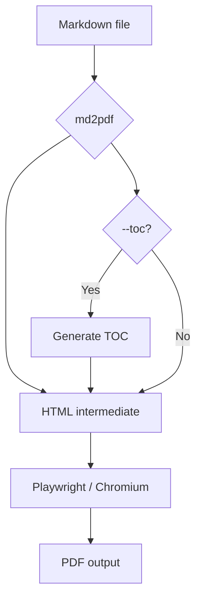
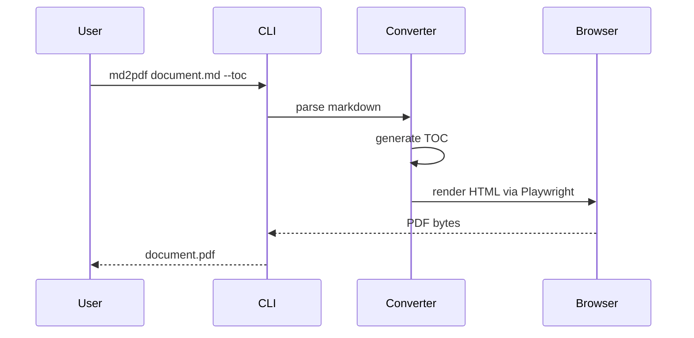

<!--
Copyright IBM Corp. 2025, 2026
SPDX-License-Identifier: Apache-2.0
Created with IBM Bob (https://bob.ibm.com)
-->

# MD to PDF — Example Document

This document demonstrates the features of the [MD to PDF converter](https://github.com/IBM/md-to-pdf).

Convert this file to PDF with:

```bash
# Basic conversion
md2pdf example.md

# With table of contents
md2pdf example.md --toc

# Landscape orientation
md2pdf example.md --landscape

# IBM Plex font preset
md2pdf example.md --font-preset ibm

# Combine options
md2pdf example.md --toc --font-preset classic --landscape
```

---

## Text Formatting

Paragraphs support **bold**, *italic*, ~~strikethrough~~, and `inline code`.

[External link](https://github.com/IBM/md-to-pdf) and internal link to [Table of Contents](#table-of-contents).

## Table of Contents

When using `--toc`, a table of contents is auto-generated from all headings in the document. The TOC supports custom depth, title, and positioning.

## Lists

### Unordered List

- First item
- Second item
  - Nested item A
  - Nested item B
    - Deeply nested item

### Ordered List

1. Step one
2. Step two
3. Step three

### Task List

- [x] Install md-to-pdf
- [x] Convert your first document
- [ ] Try batch conversion with `md2pdf-batch`
- [ ] Explore font presets

## Blockquote

> **Note:** Blockquotes are styled with a left border and slightly indented.
> They support multiple lines and are great for callouts or citations.

## Code

### Inline Code

Use `md2pdf document.md --toc` to generate a PDF with a table of contents.

### Code Block

```python
from pathlib import Path

# Convert all markdown files in a directory
for md_file in Path("docs").glob("**/*.md"):
    print(f"Converting {md_file}...")
```

```bash
# Batch convert with parallel processing
md2pdf-batch docs/ --toc --font-preset ibm -o output/
```

## Table

| Command        | Description                          | Output  |
|----------------|--------------------------------------|---------|
| `md2pdf`       | Convert a single Markdown file       | PDF     |
| `md2html`      | Convert Markdown to HTML             | HTML    |
| `html2pdf`     | Convert an HTML file to PDF          | PDF     |
| `md2pdf-batch` | Batch convert a directory            | PDF(s)  |

## Image


*Image by Sasha Matic from [Pixabay](https://pixabay.com) (free license)*

## Mermaid Diagram

### Flowchart



### Sequence Diagram


