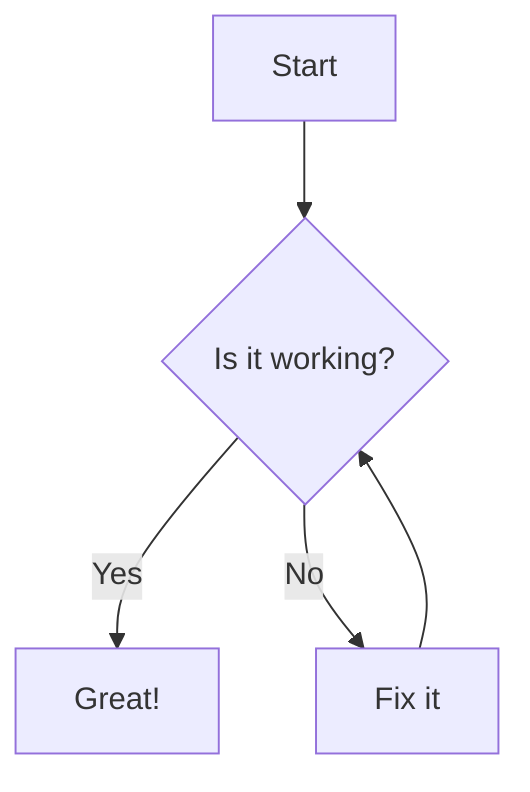

# Test Document

This is a test document to verify the Markdown to PDF conversion.

## Features

- **Bold text** and *italic text*
- [External link](https://www.example.com)
- Internal links to [Features](#features)

## Code Example

```python
def hello_world():
    print("Hello, world!")
```

## Image


Image by Sasha matic from Pixabay

## Math Formula

The quadratic formula is:

$$
x = \frac{-b \pm \sqrt{b^2 - 4ac}}{2a}
$$


## Mermaid Diagram



## Table

| Name | Description |
|------|-------------|
| md2html | Converts Markdown to HTML |
| html2pdf | Converts HTML to PDF |
| md2pdf | Converts Markdown directly to PDF |